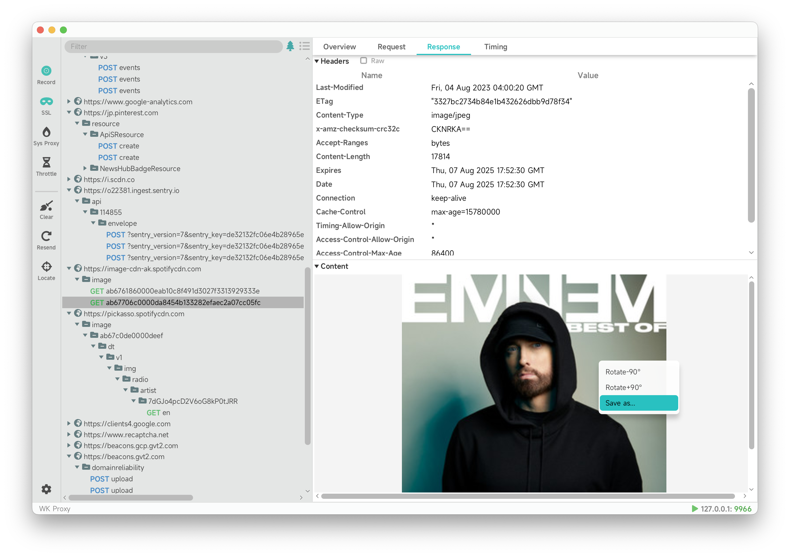
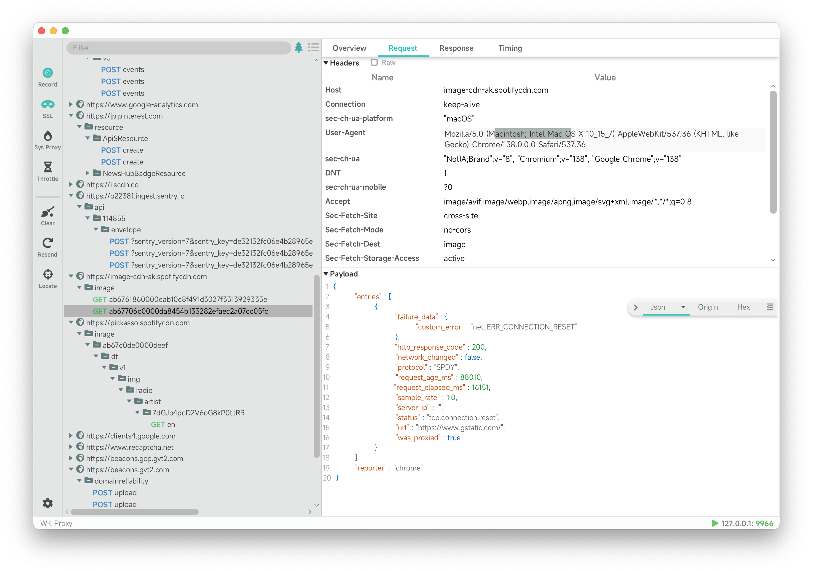
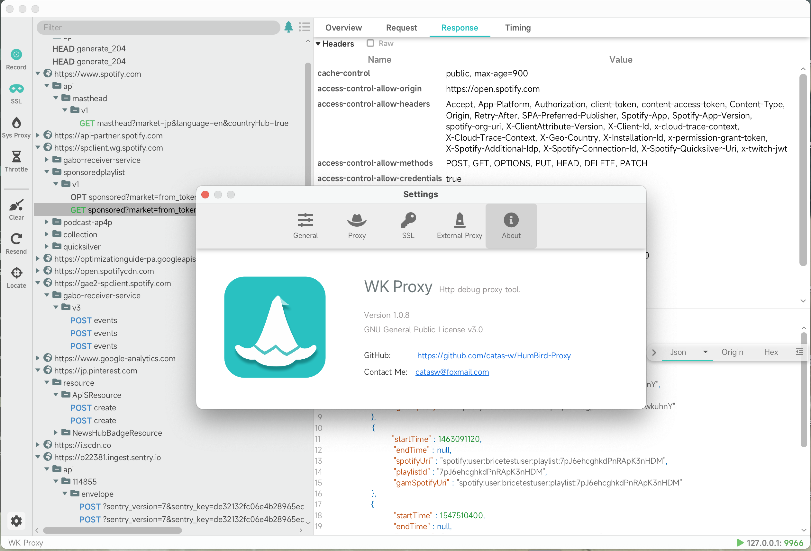

WK Proxy
=======


[](https://www.gnu.org/licenses/gpl-3.0.html)

[English](https://github.com/catas-w/WK-Proxy/blob/master/README.md) | [中文](https://github.com/catas-w/WK-Proxy/blob/master/README_zh-CN.md)

WK Proxy is an open-source desktop HTTP/HTTPS proxy and packet capture tool, available for both Windows and macOS platforms. It is designed to provide developers and testers with a clean and efficient network debugging experience.

## Features
- Natively compiled with GraalVM & Java, offering excellent performance and cross-platform support.
- HTTP/HTTPS proxy and traffic inspection, with support for intercepting and analyzing both requests and responses.
- Automatically generated root certificates with one-click installation for seamless and secure HTTPS decryption.
- WebSocket proxy support, suitable for real-time communication scenarios.
- Request throttling and replay, enabling simulation of various network conditions and testing request reliability.

## Coming Soon
- Custom request interception and modification
- Modify request content using Python scripts

## Screenshots




## Installation
### Install the binary package
1. Download the executable file for your platform from the [Github Release](https://github.com/catas-w/WK-Proxy/releases/latest)
2. Configure the runtime environment as needed.

### Run from source
- Dependencies: JDK 17.0+, Maven 3.6.3+
```shell
git clone https://github.com/catas-w/WK-Proxy.git
cd WK-Proxy
mvn clean package
cd gui/target
java -jar gui-${version}.jar
```

## Contribution
Welcome to contribute! If you have any suggestions or comments, please submit an [Issue](https://github.com/catas-w/WK-Proxy/issues)
Or contact me [catasw@foxmail.com](mailto:catasw@foxmail.com)

## Credits
This project uses the following excellent open-source projects, and we thank them for their contributions:
- [GraalVM](https://www.graalvm.org)
- [GluonFX](https://gluonhq.com/products/gluonfx)
- [Netty](https://netty.io)
- [Proxyee](https://github.com/monkeyWie/proxyee)
- [JFoenix](http://www.jfoenix.com)
- [Ikonli](https://kordamp.org/ikonli/)
- ...
