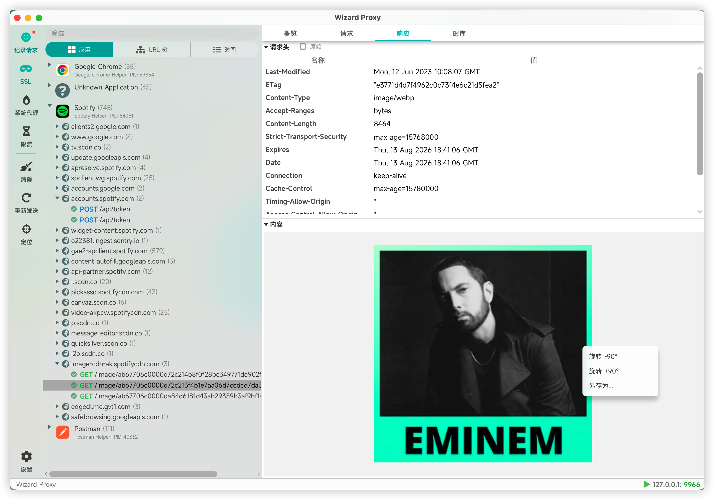
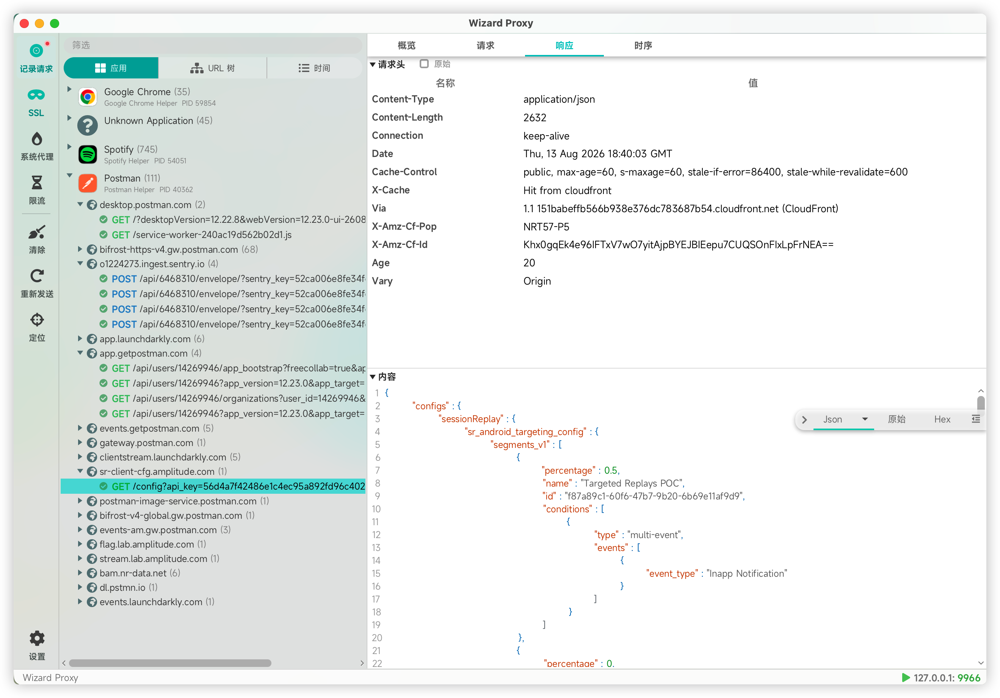
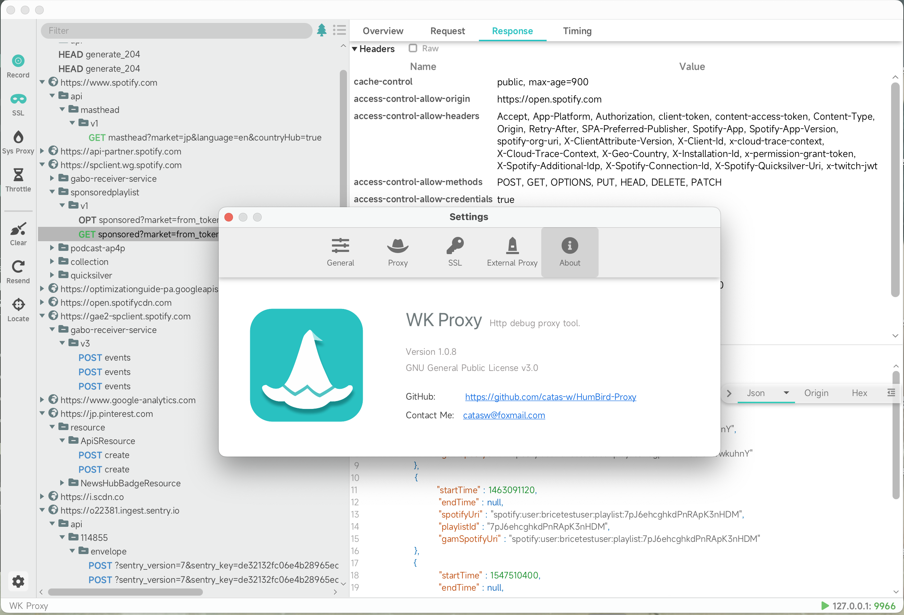

<!--@nrg.languages=en,zh-CN-->
<!--@nrg.defaultLanguage=en-->
<!--@nrg.fileNamePattern.zh-CN=README_zh-CN.md-->
WK Proxy<!--en-->
=======<!--en-->
<!--en-->
<!--en-->
[](https://www.gnu.org/licenses/gpl-3.0.html)<!--en-->
<!--en-->
[English](https://github.com/catas-w/WK-Proxy/blob/master/README.md) | [中文](https://github.com/catas-w/WK-Proxy/blob/master/README_zh-CN.md)<!--en-->
<!--en-->
WK Proxy is an open-source desktop HTTP/HTTPS proxy and packet capture tool, available for both Windows and macOS platforms. It is designed to provide developers and testers with a clean and efficient network debugging experience.<!--en-->
<!--en-->
## Features<!--en-->
- Natively compiled with GraalVM & Java, offering excellent performance and cross-platform support.<!--en-->
- HTTP/HTTPS proxy and traffic inspection, with support for intercepting and analyzing both requests and responses.<!--en-->
- Automatically generated root certificates with one-click installation for seamless and secure HTTPS decryption.<!--en-->
- WebSocket proxy support, suitable for real-time communication scenarios.<!--en-->
- Request throttling and replay, enabling simulation of various network conditions and testing request reliability.<!--en-->
<!--en-->
## Coming Soon<!--en-->
- Custom request interception and modification<!--en-->
- Modify request content using Python scripts<!--en-->
<!--en-->
## Screenshots<!--en-->
<!--en-->
<!--en-->
<!--en-->
<!--en-->
## Installation<!--en-->
### Install the binary package<!--en-->
1. Download the executable file for your platform from the [Github Release](https://github.com/catas-w/WK-Proxy/releases/latest)<!--en-->
2. Configure the runtime environment as needed.<!--en-->
<!--en-->
### Run from source<!--en-->
- Dependencies: JDK 17.0+, Maven 3.6.3+<!--en-->
```shell<!--en-->
git clone https://github.com/catas-w/WK-Proxy.git<!--en-->
cd WK-Proxy<!--en-->
mvn clean package<!--en-->
cd gui/target<!--en-->
java -jar gui-${version}.jar<!--en-->
```<!--en-->
<!--en-->
## Contribution<!--en-->
Welcome to contribute! If you have any suggestions or comments, please submit an [Issue](https://github.com/catas-w/WK-Proxy/issues)<!--en-->
Or contact me [catasw@foxmail.com](mailto:catasw@foxmail.com)<!--en-->
<!--en-->
## Credits<!--en-->
This project uses the following excellent open-source projects, and we thank them for their contributions:<!--en-->
- [GraalVM](https://www.graalvm.org)<!--en-->
- [GluonFX](https://gluonhq.com/products/gluonfx)<!--en-->
- [Netty](https://netty.io)<!--en-->
- [Proxyee](https://github.com/monkeyWie/proxyee)<!--en-->
- [JFoenix](http://www.jfoenix.com)<!--en-->
- [Ikonli](https://kordamp.org/ikonli/)<!--en-->
- ...<!--en-->
WK Proxy<!--zh-CN-->
=======<!--zh-CN-->
<!--zh-CN-->
<!--zh-CN-->
[](https://www.gnu.org/licenses/gpl-3.0.html)<!--zh-CN-->
<!--zh-CN-->
[English](https://github.com/catas-w/WK-Proxy/blob/master/README.md) | [中文](https://github.com/catas-w/WK-Proxy/blob/master/README_zh-CN.md)<!--zh-CN-->
<!--zh-CN-->
WK Proxy 是一款开源的桌面端 HTTP/HTTPS 网络代理与抓包工具，支持 Windows 和 macOS 平台，致力于为开发者与测试人员提供简洁高效的网络调试体验<!--zh-CN-->
<!--zh-CN-->
## 功能特点<!--zh-CN-->
- 基于 GraalVM 的 Java 原生编译，具备出色的性能表现与跨平台支持<!--zh-CN-->
- 支持 HTTP/HTTPS 代理与流量抓取，可拦截并解析请求与响应数据<!--zh-CN-->
- 自动生成根证书，一键安装，安全便捷地实现 HTTPS 解密<!--zh-CN-->
- 支持 WebSocket 代理，适配实时通信场景<!--zh-CN-->
- 请求限流与重发功能，便于模拟不同网络环境，提升测试覆盖与可靠性<!--zh-CN-->
<!--zh-CN-->
## 即将支持<!--zh-CN-->
- 自定义请求的拦截与修改<!--zh-CN-->
- 使用 Python 脚本动态修改请求内容<!--zh-CN-->
<!--zh-CN-->
## 预览截图<!--zh-CN-->
<!--zh-CN-->
<!--zh-CN-->
<!--zh-CN-->
<!--zh-CN-->
## 安装<!--zh-CN-->
### 安装二进制包<!--zh-CN-->
1.	从 [Github Release](https://github.com/catas-w/WK-Proxy/releases/latest) 下载适配平台的可执行文件。<!--zh-CN-->
2.	按需配置运行环境（如必要的依赖项）。<!--zh-CN-->
<!--zh-CN-->
### 从源码运行<!--zh-CN-->
- 依赖：JDK 17.0+, Maven 3.6.3+<!--zh-CN-->
```shell<!--zh-CN-->
git clone https://github.com/catas-w/WK-Proxy.git<!--zh-CN-->
cd WK-Proxy<!--zh-CN-->
mvn clean package<!--zh-CN-->
cd gui/target<!--zh-CN-->
java -jar gui-${version}.jar<!--zh-CN-->
```<!--zh-CN-->
<!--zh-CN-->
## Contribution<!--zh-CN-->
欢迎贡献！有任何建议或意见您可以给我们提 [Issue](https://github.com/catas-w/WK-Proxy/issues), <!--zh-CN-->
或联系本人 [catasw@foxmail.com](mailto:catasw@foxmail.com)<!--zh-CN-->
<!--zh-CN-->
## Credits<!--zh-CN-->
本项目使用了以下优秀的开源项目，感谢他们的贡献：<!--zh-CN-->
- [GraalVM](https://www.graalvm.org)<!--zh-CN-->
- [GluonFX](https://gluonhq.com/products/gluonfx)<!--zh-CN-->
- [Netty](https://netty.io)<!--zh-CN-->
- [Proxyee](https://github.com/monkeyWie/proxyee)<!--zh-CN-->
- [JFoenix](http://www.jfoenix.com)<!--zh-CN-->
- [Ikonli](https://kordamp.org/ikonli/)<!--zh-CN-->
- ...<!--zh-CN-->
