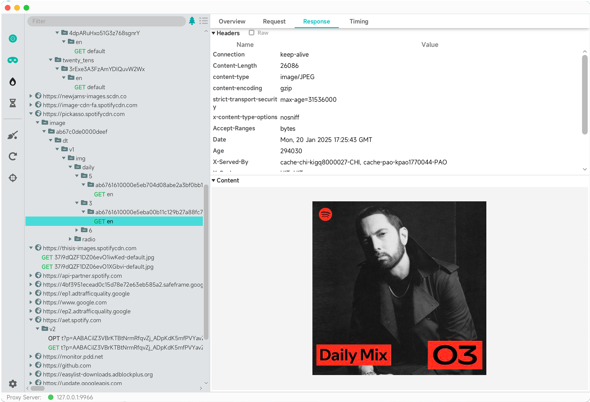
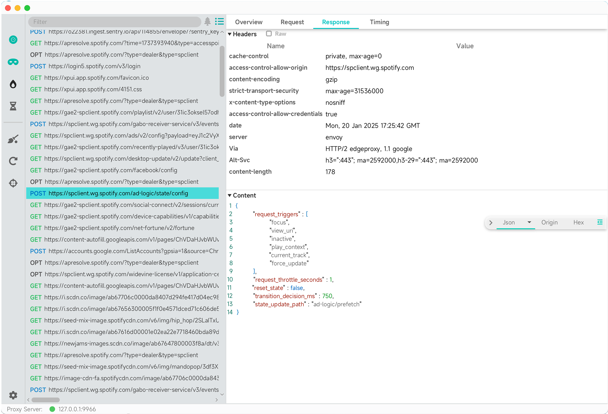
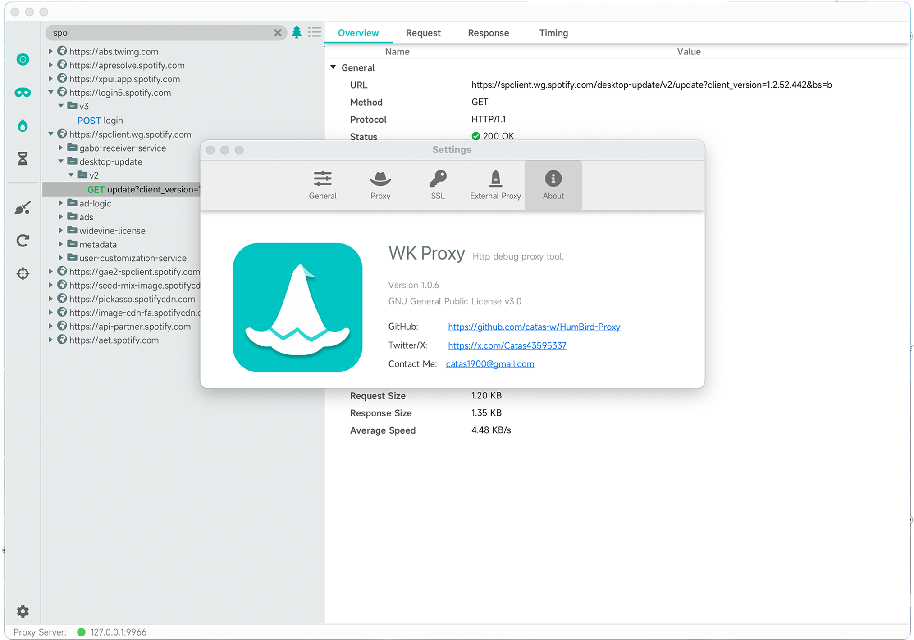

WK Proxy
=======


[](https://www.gnu.org/licenses/gpl-3.0.html)

[English](https://github.com/catas-w/WK-Proxy/blob/master/README.md) | [中文](https://github.com/catas-w/WK-Proxy/blob/master/README_zh-CN.md)

WK Proxy 是一款开源的桌面端 HTTP 代理与抓包工具，支持 Windows 和 macOS 平台，致力于为开发者和测试人员提供简单高效的网络调试体验。

## Features
- 基于 GraalVM & Java 的原生编译, 提供卓越的性能与跨平台支持.
- HTTP/HTTPS 代理与抓包,支持拦截、查看 HTTP/HTTPS 请求与响应数据.
- 自定义根证书, 证书一键安装, 支持 HTTPS 解析，安全可靠.
- WebSocket 代理支持 适配实时通信场景.
- 请求限流与重发 方便模拟不同网络环境与测试请求的可靠性.

## Screenshots




## Installation
### 安装二进制包
1.	从 [Github Release](https://github.com/catas-w/WK-Proxy/releases/latest) 下载适配平台的可执行文件。
2.	按需配置运行环境（如必要的依赖项）。

### 从源码运行
- 依赖：JDK 17.0+, Maven 3.6.3+
```shell
git clone https://github.com/catas-w/WK-Proxy.git
cd WK-Proxy
mvn clean package
cd gui/target
java -jar gui-${version}.jar
```

## Contribution
欢迎贡献！有任何建议或意见您可以给我们提 [Issue](https://github.com/catas-w/WK-Proxy/issues), 
或联系本人 [catasw@foxmail.com](mailto:catasw@foxmail.com)

## Credits
本项目使用了以下优秀的开源项目，感谢他们的贡献：
- [GraalVM](https://www.graalvm.org)
- [GluonFX](https://gluonhq.com/products/gluonfx)
- [Netty](https://netty.io)
- [Proxyee](https://github.com/monkeyWie/proxyee)
- [JFoenix](http://www.jfoenix.com)
- [Ikonli](https://kordamp.org/ikonli/)
- ...
